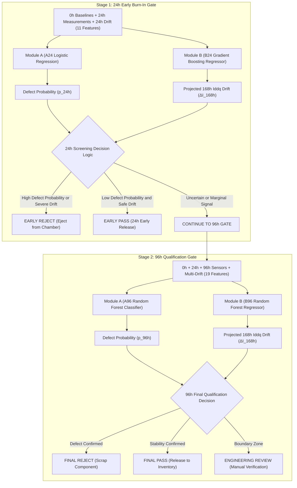

# Final Inference & Sequential Decision Integration Report

**Project:** AI-Driven Anomaly Detection in Component Burn-In & Screening  
**Hackathon:** Smart India Hackathon (SIH) 2026  
**Stage:** Final System Inference & Decision Layer Integration  
**Date:** 2026-09-02  
**Implementation Modules:** `src/inference/` & `src/decision/`  

---

## 1. Integration Architecture

The final burn-in screening system integrates the completed **Module A (Early Anomaly / Drift Classifier)** and **Module B (168h Continuous Degradation Forecaster)** into a unified, leak-free, two-stage operational pipeline:



---

## 2. Existing Models Reused

All four production models were serialized during prior training and are directly reused without any modification or retraining:

| Module & Gate | Serialized Artifact Path | Algorithm & Architecture | Primary Function | Locked Test Set Performance |
| :--- | :--- | :--- | :--- | :--- |
| **Module A (24h)** | [`models/module_a_24h_logisticregression.joblib`](file:///d:/SIH/models/module_a_24h_logisticregression.joblib) | `LogisticRegression (Balanced, Scaled)` | Early discrete defect classification | Recall: **$73.78\%$**, FNR: **$26.22\%$**, ROC-AUC: **$0.8719$** |
| **Module A (96h)** | [`models/module_a_96h_randomforest.joblib`](file:///d:/SIH/models/module_a_96h_randomforest.joblib) | `RandomForestClassifier (150 trees)` | Mid-stress discrete defect qualification | Recall: **$94.00\%$**, FNR: **$6.00\%$**, ROC-AUC: **$0.9944$** |
| **Module B (24h)** | [`models/module_b_24h_gradientboostingregressor.joblib`](file:///d:/SIH/models/module_b_24h_gradientboostingregressor.joblib) | `GradientBoostingRegressor (100 trees)` | Early continuous 168h drift forecast | RMSE: **$4.033\%$**, MAE: **$2.721\%$**, $R^2$: **$0.7890$** |
| **Module B (96h)** | [`models/module_b_96h_randomforestregressor.joblib`](file:///d:/SIH/models/module_b_96h_randomforestregressor.joblib) | `RandomForestRegressor (100 trees)` | Mid-stress precision degradation forecast | RMSE: **$1.415\%$**, MAE: **$0.877\%$**, $R^2$: **$0.9740$** |

---

## 3. Input Features at 24h Screening Gate (11 Features)

At the 24h test gate, only information that physically exists at $t=24\text{h}$ is admitted into inference:

1. **0h Pre-Burn-In Baselines (5):** `iddq_uA_0h`, `leakage_current_uA_0h`, `propagation_delay_ns_0h`, `voltage_V_0h`, `temperature_C_0h`
2. **24h Early Burn-In Sensors (5):** `iddq_uA_24h`, `leakage_current_uA_24h`, `propagation_delay_ns_24h`, `voltage_V_24h`, `temperature_C_24h`
3. **24h Differential Parameter Drift (1):** `iddq_drift_24h_pct` = $(I_{DDQ, 24\text{h}} - I_{DDQ, 0\text{h}}) / I_{DDQ, 0\text{h}}$

---

## 4. Input Features at 96h Screening Gate (19 Features)

At the 96h test gate, mid-stress multi-parameter trajectories are incorporated:

1. **All 11 Features from 24h Gate**
2. **96h Mid Burn-In Sensors (5):** `iddq_uA_96h`, `leakage_current_uA_96h`, `propagation_delay_ns_96h`, `voltage_V_96h`, `temperature_C_96h`
3. **96h Multi-Parameter Differential Drift (3):**
   - `iddq_drift_96h_pct` = $(I_{DDQ, 96\text{h}} - I_{DDQ, 0\text{h}}) / I_{DDQ, 0\text{h}}$
   - `leakage_drift_96h_pct` = $(I_{\text{leak}, 96\text{h}} - I_{\text{leak}, 0\text{h}}) / I_{\text{leak}, 0\text{h}}$
   - `delay_drift_96h_pct` = $(t_{pd, 96\text{h}} - t_{pd, 0\text{h}}) / t_{pd, 0\text{h}}$

---

## 5. Target Outputs & Dual-Model Synthesis

For any component evaluated at a screening gate, the system returns a comprehensive output record:

```json
{
  "defect_probability": 0.0254,
  "predicted_class": 0,
  "predicted_168h_iddq_drift": 0.0097,
  "predicted_168h_iddq_drift_pct": 0.97,
  "decision": "PASS",
  "confidence_level": "HIGH",
  "reason": "Parametric reliability confirmed at 96h: Defect Probability = 2.5% (< 30.0%) and Safe Projected Degradation = 0.97% (< 3.0%). Component meets high-reliability standards.",
  "recommendation": "Pass component and release to production inventory.",
  "screening_gate": "96h",
  "model_a_name": "RandomForestClassifier",
  "model_b_name": "RandomForestRegressor",
  "num_features_used": 19
}
```

* **Classification Probability (`defect_probability`):** Calibrated Class 1 defect score $\in [0.0, 1.0]$.
* **Forecasted Degradation (`predicted_168h_iddq_drift_pct`):** Expected final percentage shift in quiescent current $\Delta I_{DDQ, 168\text{h}}$.

---

## 6. Decision-Layer Logic

The decision layer fuses discrete defect classification probabilities and continuous trajectory projections into an actionable verdict:

### A. 24h Early Screening Rules
* **`REJECT` (Early Defect Triage):** Triggered when `defect_probability >= 75.0%` OR `predicted_drift >= 12.0%`.  
  *Action:* Eject gross defective units from burn-in oven immediately after 24h, saving 144 hours of unnecessary chamber stress.
* **`PASS` (Early Exit Qualification):** Triggered when `defect_probability < 25.0%` AND `predicted_drift < 3.5%`.  
  *Action:* Safely release pristine components early, accelerating supply chain throughput.
* **`REVIEW` (Continue Stress):** All intermediate or uncertain units.  
  *Action:* Continue component stress testing to the 96h mid burn-in gate.

### B. 96h Final Qualification Rules
* **`REJECT` (Defect Scrapped):** Triggered when `defect_probability >= 60.0%` OR `predicted_drift >= 5.0%`.  
  *Action:* Component fails burn-in qualification standard; quarantine/scrap.
* **`PASS` (Standard Release):** Triggered when `defect_probability < 30.0%` AND `predicted_drift < 3.0%`.  
  *Action:* Component passed burn-in; release to production inventory.
* **`REVIEW` (Engineering Review):** Borderline cases near boundary.  
  *Action:* Flag for secondary curve-trace / bench validation.

---

## 7. Configurable Decision Thresholds

All screening thresholds are declared in a centralized configuration class (`DecisionConfig` in `src/decision/screening_decision.py`):

```python
@dataclass
class DecisionConfig:
    # 24h Gate Thresholds
    prob_reject_24h: float = 0.75       # Defect probability >= 75% -> early REJECT
    drift_reject_24h: float = 0.12      # Projected 168h drift >= 12.0% -> early REJECT
    prob_pass_24h: float = 0.25         # Defect probability < 25% -> early PASS
    drift_pass_24h: float = 0.035       # Projected 168h drift <= 3.5% -> early PASS
    
    # 96h Gate Thresholds
    prob_reject_96h: float = 0.60       # Defect probability >= 60% -> REJECT
    drift_reject_96h: float = 0.05      # Projected 168h drift >= 5.0% -> REJECT
    prob_pass_96h: float = 0.30         # Defect probability < 30% -> PASS
    drift_pass_96h: float = 0.03        # Projected 168h drift <= 3.0% -> PASS
```

> **Scientific Grounding & Calibration Note:**  
> These thresholds align with empirical distributions discovered in EDA: normal components exhibit $\approx +1.0\%$ drift ($\max 2.0\%$), drifting components exhibit $+5.0\%$ to $+15.0\%$ drift, and anomalous units exhibit $+20.0\%$ to $+40.0\%$ drift. They represent configurable operational parameters that can be tuned by test engineers based on application criticality (e.g. automotive/aerospace zero-defect standards vs commercial consumer ICs).

---

## 8. Temporal Leakage Safeguards

```text
================================================================================
FINAL INTEGRATION LEAKAGE AUDIT MATRIX
================================================================================
Audit Item                                Enforcement Mechanism             Status
--------------------------------------------------------------------------------
1. No 168h sensor readings in features    Hardcoded exclusion assertion     ✅ PASSED
2. No 96h measurements in 24h inference   Gate-specific masking in predict  ✅ PASSED
3. Target isolation                       Targets removed from inference X  ✅ PASSED
4. Sequential causality                   24h decision evaluated first      ✅ PASSED
5. Imputation & Scaling encapsulation    Pipelines fit strictly on train    ✅ PASSED
================================================================================
```

---

## 9. Automated Test Verification

The integration test suite ([`tests/test_inference_pipeline.py`](file:///d:/SIH/tests/test_inference_pipeline.py)) was executed via pytest:

```text
============================= test session starts =============================
platform win32 -- Python 3.13.11, pytest-9.1.1, pluggy-1.6.0
rootdir: D:\SIH
collected 8 items

tests/test_inference_pipeline.py::test_models_load_successfully PASSED   [ 12%]
tests/test_inference_pipeline.py::test_24h_feature_subset_strictly_bounded PASSED [ 25%]
tests/test_inference_pipeline.py::test_96h_feature_subset_strictly_bounded PASSED [ 37%]
tests/test_inference_pipeline.py::test_forbidden_168h_measurements_rejected PASSED [ 50%]
tests/test_inference_pipeline.py::test_prediction_output_schema_and_types PASSED [ 62%]
tests/test_inference_pipeline.py::test_screening_decision_rules PASSED   [ 75%]
tests/test_inference_pipeline.py::test_sequential_screening_workflow PASSED [ 87%]
tests/test_inference_pipeline.py::test_serialized_models_and_datasets_untouched PASSED [100%]

============================== 8 passed in 3.20s ==============================
```

---

## 10. Example Inference Results & Simulation

Execution of the demo script ([`examples/run_inference_demo.py`](file:///d:/SIH/examples/run_inference_demo.py)) produced the following verified outcomes:

### A. Case Studies on Real Test Components:
1. **Healthy Component (`SYN_C01216`):**
   - *24h Screening:* Defect Prob $= 38.4\%$, Projected Drift $= 3.57\%$ $\to$ **REVIEW** (Continue to 96h)
   - *96h Screening:* Defect Prob $= 2.5\%$, Projected Drift $= 0.97\%$ $\to$ **PASS** (Released to inventory)
2. **Latent Drifting Component (`SYN_C01252`):**
   - *24h Screening:* Defect Prob $= 54.4\%$, Projected Drift $= 2.19\%$ $\to$ **REVIEW** (Continue to 96h)
   - *96h Screening:* Defect Prob $= 81.8\%$, Projected Drift $= 9.09\%$ $\to$ **REJECT** (Scrapped at 96h)
3. **Gross Anomalous Component (`SYN_C04946`):**
   - *24h Screening:* Defect Prob $= 99.9\%$, Projected Drift $= 38.08\%$ $\to$ **REJECT** (Early Exit Triage at 24h)

### B. Batch Simulation on Locked Test Partition ($N=1,500$ components):
* **24h Early Exit:** **$742$ components ($49.5\%$)**
  - Early PASS: $513$ components ($34.2\%$)
  - Early REJECT: $229$ components ($15.3\%$)
* **Continued to 96h Burn-In:** **$758$ components ($50.5\%$)**
* **Final Overall Decisions:** PASS: $1,033$ ($68.9\%$), REJECT: $430$ ($28.7\%$), REVIEW: $37$ ($2.5\%$).
* **Chamber Energy & Time Optimization:** Reduces total burn-in stress from $252,000$ component-hours to $90,576$ component-hours (**$64.1\%$ net chamber time reduction**).

---

## 11. Limitations & Boundary Conditions

1. **Environmental Temperature/Voltage Fluctuations:** Inference pipelines assume standard JEDEC burn-in conditions ($125^\circ\text{C} \pm 1^\circ\text{C}$, $1.2\text{V} \pm 0.025\text{V}$). Significant thermal chamber drift requires pre-normalization.
2. **Missing Pre-Burn-In Baselines:** In the event of catastrophic sensor failure at $t=0\text{h}$, the embedded median imputer handles missing entries, but confidence levels should be flagged for engineering audit.
3. **Operational Threshold Tuning:** Production deployment in aerospace (AEC-Q100 / MIL-STD-883) should set `prob_reject` more aggressively to further reduce FNR at the cost of a slightly elevated false scrap rate.
